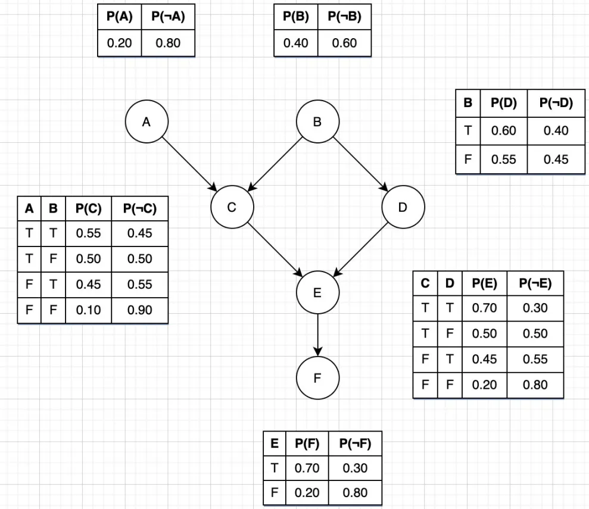
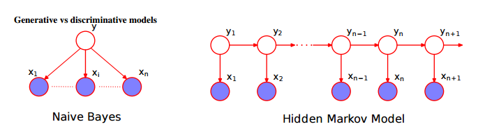
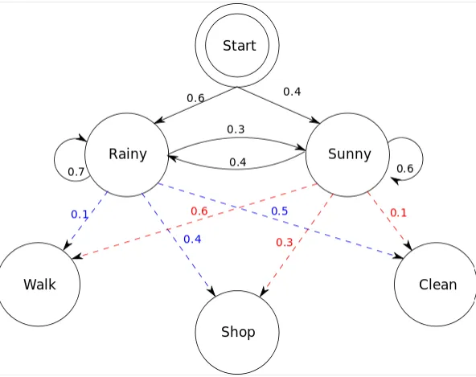
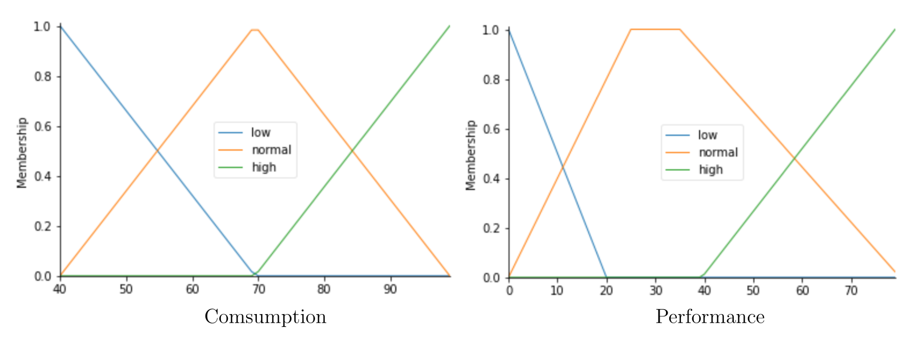
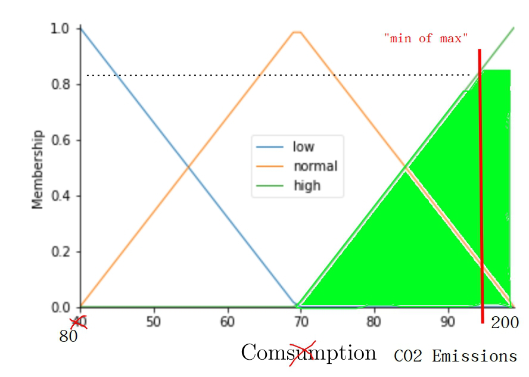

<style>
img
{
    display:block;
    float:none;
    margin-left:auto;
    margin-right:auto;
    width:100%;
}
</style>

# Exame Solutions

## ($3.0$) 1. Answer the following questions: 

### (a) Explain how relevant is a family of hash functions to a Bloom filter algorithm. 

#### Confidence: 95%

A family of hash functions is essential to a Bloom filter algorithm because it determines how elements are mapped into the bit array. When we insert an element, we use multiple different hash functions to set multiple bits to 1. When we query an element, we check if all the bits set by the hash functions are 1. If any of them are 0, we know the element is not in the filter with certainty (no false negatives). If all of them are 1, the element might be in the filter but we can't be sure (possible false positives). 

False positives are possible because multiple elements can hash to the same bits, but false negatives are not possible because if an element is in the filter, all its bits will be set to 1.

Using too few hash functions means we don't set enough bits, making it easier for different elements to appear the same. On the other hand, using too many hash functions means we set too many bits to 1, eventually causing most queries to return false positives as the bit array becomes saturated. The optimal number of hash functions (to minimize false positives), assuming uniform hashing, depends on the size of the bit array ($m$) and the expected number of elements ($n$), calculated as: 

$$k = \frac{m}{n} \ln(2)$$

A good family of hash functions should satisfy the following conditions:

- **Uniformity**: The hash functions should distribute values uniformly across the bit array to reduce collisions.

- **Independence**: The hash functions should behave independently to avoid biased mappings.

- **Efficiency**: Computing the hash functions should be computationally inexpensive since multiple hash values are computed per operation.

For instance, cryptographic hash functions like MD5 or SHA-256 can provide high-quality hashes but are often overkill in terms of computational cost. Non-cryptographic options like MurmurHash or CityHash are typically better suited for Bloom filters.

### (b) State the CAP theorem and its consequences on storing/accessing geographic data. 

#### Confidence: 85%

The CAP theorem states that in a distributed system, it's impossible to simultaneously guarantee all three of these properties: 

- **Consistency (C)**: all nodes see the same data at the same time;

- **Availability (A)**: every request gets a response  (it may not be the most up-to-date);

- **Partition tolerance (P)**: the system continues to work even if network communication fails between nodes.

For geographic data, this means we often have to choose between:

- Having consistent geographic data across all servers but potentially being unavailable during network issues;

- Having high availability but possibly showing different geographic data on different servers;

- Sacrificing some consistency or availability to handle network partitions and ensure the system remains operational.

Due to the nature of distributed systems, partition tolerance is often mandatory (network failures are inevitable). Most geographic systems prioritize availability and partition tolerance over strict consistency, accepting that location data might be slightly outdated or inconsistent across different servers.


### (c) Identify the different perspectives of Big Data, in particular, explain in detail the perspective *HighVelocity*.

#### Confidence: 95%

Big Data is often broken down into 4 main dimensions or perspectives, commonly referred to as the 4 V's:

- **Volume**: the amount of data being generated and stored;

- **Velocity**: the speed at which data is generated, transmitted, and processed;

- **Variety**: the different types of data being collected (structured, unstructured, semi-structured);

- **Veracity**: the quality and trustworthiness of the data.

Some frameworks also include **Value** to represent the usefulness of the data in decision-making.

High Velocity refers to the speed at which data is being generated and the rate at which it must be processed. This perspective is often associated with real-time data streams, IoT devices, social media feeds, financial transactions, etc.

For example, a traffic monitoring system needs to process thousands of sensor readings per second to provide real-time traffic updates. The challenge isn't just storing this data, but processing it fast enough to make immediate decisions. This often requires specialized streaming algorithms and technologies like Apache Kafka, Spark Streaming, or Storm that can handle high-throughput data streams.

By contrast, the volume perspective focuses on handling petabytes or exabytes of data stored across distributed systems, while the variety perspective deals with the different formats and structures of data (e.g., text, images, videos), and veracity is concerned with the accuracy and reliability of data, especially in the context of noisy or incomplete datasets.

High velocity is particularly relevant in applications requiring real-time insights, such as stock trading, live sports analytics, and online recommendation engines.

## ($4.5$) 2. Consider the following Bayesian network:



### (a) Determine the probability of an event $X$ with probability given by: $$P(A = true, B = f alse, C = true, D = f alse, F = true)$$ Note that $X$ depends indirectly on $E$.

#### Confidence: 90%

To calculate the probability of event X, we need to consider the joint probability of all the variables involved. Since X depends indirectly on E, we need to marginalize over E to get the probability of X. Marginalization involves summing over all possible values of E.

The probability of X can be calculated using the chain rule of probability:

<br>

$$
\begin{split}
P(X) &= P(A = T) \times P(B = F) \\ 
&\times P(C = T | A = T, B = F) \\
&\times P(D = F | B = F) \\
&\times \sum_{E} P(E | C = T, D = F) \times P(F | E)
\end{split}
$$

<br>

Given the conditional probabilities provided, we can substitute the values and calculate the result:

<br>

$$
\begin{split}
P(X) &= 0.20 \times 0.60 \times 0.50 \times 0.45 \\
    &\times [ P(E = T | C = T, D = F) \times P(F = T | E = T) \\
    &+ P(E = F | C = T, D = F) \times P(F = T | E = F)]
\end{split}
$$

<br>

Now, we can substitute the conditional probabilities for E and F:

<br>

$$
\begin{split}
P(X) &= 0.20 \times 0.60 \times 0.50 \times 0.45 \times [0.50 \times 0.70 + 0.50 \times 0.20] \\
    &= 0.20 \times 0.60 \times 0.50 \times 0.45 \times [0.35 + 0.10] \\
    &= 0.20 \times 0.60 \times 0.50 \times 0.45 \times 0.45 \\
    &= 0.00243
\end{split}
$$

<br>

### (b) Explain if the above network can be seen as a Hidden Markov Model.

#### Confidence: 95%





Hidden Markov Models (HMMs) and Bayesian Networks (BNs) are two common methods of statistical modeling that can handle uncertainty, complexity, and dependencies in data. They both use probabilistic reasoning and graphical representations to capture the relationships between variables and infer hidden or unknown states. However, they also have some key differences and similarities that affect their performance, applicability, and interpretation.

BNs are a general class of graphical models that represent the joint probability distribution of a set of variables using nodes and edges. The nodes correspond to the variables, which can be discrete or continuous, observable or hidden, and the edges indicate the conditional dependencies between them. The edges can be directed or undirected, depending on whether the model is causal or non-causal. The parameters of the BN are the conditional probability tables or functions associated with each node, given its parents. BNs can be used to perform tasks such as inference, learning, reasoning, and decision making under uncertainty.

HMMs are a special type of BNs that model sequential data, such as speech, text, or time series. They assume that the data is generated by a hidden or latent variable that follows a Markov process, meaning that it only depends on its previous state. The hidden variable can take a finite number of discrete values, called states, and each state has a probability distribution over the observable data, called emissions. The transition probabilities between states and the emission probabilities are the parameters of the HMM. HMMs can be used to perform tasks such as recognition, classification, prediction, and segmentation of sequential data.

One of the main differences between HMMs and BNs is the structure of the graph. HMMs have a linear and directed graph, where the hidden variable is the only parent of the observable variable at each time step, and there are no cycles or feedback loops. BNs can have any arbitrary graph structure, as long as it is acyclic, and the variables can have multiple parents or children, or none at all. Another difference is the type of data that they can handle. HMMs are designed for sequential data, where the order and length of the observations matter, and the hidden variable has a discrete and finite state space. BNs can handle any type of data, where the observations can be independent or correlated, and the variables can have discrete, continuous, or mixed domains.

Despite their differences, HMMs and BNs also share some common features and principles. They both use probabilistic reasoning and graphical representations to capture the uncertainty, complexity, and dependencies in data. They both allow for inference and learning from incomplete or noisy data, by using Bayes' rule and maximum likelihood estimation. They both can be extended and modified to suit different scenarios and objectives, by using different types of nodes, edges, distributions, or algorithms. They both have advantages and limitations, depending on the data quality, quantity, and characteristics, as well as the computational resources and time available.

HMMs have been widely used for various applications in different domains, such as natural language processing, speech recognition, bioinformatics, computer vision, and finance. For example, in speech recognition, an HMM can model the speech signal as a sequence of acoustic units, such as phonemes or words, that are emitted by a hidden state that corresponds to the speaker's intention or context. The HMM can then be trained on a large corpus of speech data, and used to decode or recognize the speech input from a new speaker or utterance. Another example is in bioinformatics, where an HMM can model the DNA or protein sequences as a sequence of nucleotides or amino acids, that are emitted by a hidden state that corresponds to the functional or structural role of the sequence. The HMM can then be used to align, annotate, or classify the sequences based on their similarity or dissimilarity.

BNs have also been widely used for various applications in different domains, such as medicine, engineering, ecology, sociology, and artificial intelligence. For example, in medicine, a BN can model the diagnosis of a disease as a function of the symptoms, risk factors, test results, and treatments of a patient, using nodes and edges to represent the causal or probabilistic relationships between them. The BN can then be used to infer the probability of the disease given the evidence, or to suggest the best course of action given the preferences and constraints of the patient. Another example is in artificial intelligence, where a BN can model the behavior of an agent or a system as a function of its goals, beliefs, actions, and outcomes, using nodes and edges to represent the rational or heuristic decision making process. The BN can then be used to plan, optimize, or simulate the agent's or system's actions given the environment and the uncertainty. 

### Summary of Bayesian Networks vs. Hidden Markov Models

| Feature | Bayesian Networks | Hidden Markov Models |
|---------|-------------------|----------------------|
| State Visibility | All states are observable. | States are hidden and not directly observable. |
| Model Complexity | More complex, with multiple types of nodes and edges. | Simpler, with fewer types of nodes and transitions. |
| Parameter Estimation | Uses conditional probabilities and Bayes' rule for inference. | Uses algorithms like Baum-Welch for parameter estimation. |
| Dependence | Nodes can have multiple parents and complex dependencies. | Predictions depend on observed outputs, providing indirect information about the states. |
| Applications | Suitable for modeling complex systems with multiple variables. | Ideal for processes where states are inferred through outputs (e.g., speech recognition, genetic sequence analysis). |
| Diagrams | Complex graphs with various types of nodes and conditional dependencies. | Layered diagrams including states, outputs, and both transition and emission probabilities. |

## ($1.0$) 3. For a dataset with 3 million records, consider a Machine Learning method based on weights with an update method: $$ w_{k+1} = w_k + h \times (3x - w_k)^2 \times f(k, x) $$ for some function $1 < f(k, x) < 2$, $k \in \{1, 2, 3, ...\}$, and $x \in [0, 5]$. How can you compute the value of the constant $h > 0$ to ensure that the method converges? Write the associated differential equation for the Euler method and explain how can be used to improve the original method.

The Euler method is a first-order numerical procedure for solving ordinary differential equations (ODEs) with a given initial value. It approximates the solution by taking small steps from the initial value in the direction of the derivative.

Our weight update rule is:

$$w_{k+1} = w_k + h \times (3x - w_k)^2 \times f(k, x)$$

which we can rewrite as:

$$w_{k+1} = w_k + h \times g(w_k)$$

where $g(w_k) = (3x - w_k)^2 f(k, x)$. 

This update rule is actually a discrete approximation of a continuous differential equation $\dfrac{dw}{dt} = g(w)$ using the Euler method, which takes small steps of size $h$ to approximate the continuous solution.

To analyze when this method will converge, we need to understand what happens when our weight gets slightly perturbed from its current value. We can use Taylor series expansion for this analysis. The Taylor series lets us approximate a function around a point by using its derivatives: if we perturb a point $a$ by a small amount $\epsilon$, then:
$$f
(a + \epsilon) \approx f(a) + f'(a)\epsilon
$$
for small $\epsilon$, dropping higher-order terms since they become negligible for small perturbations.

If we perturb our weight by a small amount $\epsilon$, so $w_k$ becomes $w_k + \epsilon$, our update becomes:
$$
w_{k+1} = (w_k + \epsilon) + h \times g(w_k + \epsilon)
$$ 

Using the Taylor approximation for $g(w_k + \epsilon)$, we get:
$$
g(w_k + \epsilon) \approx g(w_k) + g'(w_k)\epsilon
$$

Substituting this back gives us:
$$
\begin{split}
w_{k+1} &= w_k + \epsilon + h \times (g(w_k) + g'(w_k)\epsilon) \\
&= w_k + \epsilon + h \times g(w_k) + h \times g'(w_k)\epsilon \\
&= [w_k + h \times g(w_k) ] + \epsilon[1 + h \times g'(w_k)]
\end{split}
$$

The first bracket is our normal update, and the second shows how the perturbation evolves: 
$$
\epsilon_{new} = \epsilon(1 + hg'(w_k))
$$

For our method to be stable, perturbations should decrease over time, meaning $|\epsilon_{new}| < |\epsilon|$. This gives us our stability criterion: 

$$
\begin{split}
|\epsilon_{new}| &< |\epsilon| \\
|\epsilon(1 + hg'(w_k))| &< |\epsilon| \\
|1 + hg'(w_k)| &< 1
\end{split}
$$ 

To apply this, we need to find $g'(w_k)$. Taking the derivative of $(3x - w_k)^2 f(k, x)$ with respect to $w_k$ gives us:
$$
g'(w_k) = -2(3x - w_k)f(k, x)
$$. 

Given our constraints that $x \in [0, 5]$ and $1 < f(k, x) < 2$, we can find that $|g'(w_k)|$ reaches its maximum value of $60$ when $x = 5$ and $w_k = 0$:

$$  
\begin{split}
|g'(w_k)| &= |-2(3 \times 5 - 0)f(k, 5)| \\
&= |-2 \times 15f(k, 5)| \\
&= 30f(k, 5) \\
\end{split}
$$

Since $1 < f(k, x) < 2$, we know $30 < |g'(w_k)| < 60$.

Therefore, for stability we need:

$$
\begin{split}
|1 + hg'(w_k)| < 1 \\
-1 < 1 + hg'(w_k) < 1 \\
-2 < hg'(w_k) < 0 \\
\end{split}
$$

Since we know $30 < |g'(w_k)| < 60$, and $g'(w_k)$ is negative (from the derivative we calculated earlier $g'(w_k) = -2(3x - w_k)f(k, x)$), we actually have $-60 < g'(w_k) < -30$.

This gives us the range for $h$, when assuming the worst-case scenario of $g'(w_k) = -60$:
$$
-2 < h \times -60 < 0
$$

Dividing by -60 (which reverses the inequalities):
$$
\begin{split}
\frac{-2}{-60} &> h > \frac{0}{-60} \\
0 &< h < \frac{1}{30} \\
0 &< h < 0.0333
\end{split}
$$

For additional safety margin considering the large dataset size of 3 million records, we might choose an even more conservative value of $h < 1/60 ≈ 0.0167$. This choice of h ensures our weight updates will converge rather than diverge.

The associated differential equation that our Euler method approximates is:
$$
\frac{dw}{dt} = (3x - w)^2f(k, x)
$$

The Euler method approximates this continuous equation by updating $w$ discretely at step size $h$. While reducing $h$ can improve accuracy, this increases computational cost and can accumulate round-off errors. A more effective improvement is using higher-order methods like the fourth-order Runge-Kutta (RK4), which achieves better accuracy with larger step sizes by using multiple intermediate evaluations within each step, reducing the discretization error while maintaining computational efficiency.

The Euler method is a first-order method with local error $O(h^2)$ and global error $O(h)$, meaning that reducing $h$ by a factor of 10 reduces the error by a factor of 100.In contrast, the RK4 method is a fourth-order method with local error $O(h^5)$ and global error $O(h^4)$, allowing for larger step sizes while maintaining stability and accuracy. This makes RK4 more efficient and accurate, particularly for large datasets like the one in question. The RK4 method updates weights using four intermediate calculations:

$$
\begin{split}
k_1 &= g(w_k) \\
k_2 &= g(w_k + \frac{h}{2}k_1) \\
k_3 &= g(w_k + \frac{h}{2}k_2) \\
k_4 &= g(w_k + hk_3) \\
w_{k+1} &= w_k + \frac{h}{6}(k_1 + 2k_2 + 2k_3 + k_4)
\end{split}
$$


Additionally, we can implement adaptive step size control by estimating the local truncation error at each step and dynamically adjusting $h$ to maintain desired accuracy while using the largest possible step size. This is particularly valuable for our dataset with 3 million records, as it can significantly reduce computation time while ensuring accuracy where needed.

Furthermore, we could use implicit methods like the backward Euler method:
$$
w_{k+1} = w_k + hg(w_{k+1})
$$
These methods typically offer better stability properties than explicit methods, allowing larger step sizes while maintaining convergence. These improvements make the method more efficient and accurate, which is particularly important given the large dataset size.

## ($4.5$) 4. Consider the Fuzzy sets, related to the operation of a heavy machine, with variables *Consumption* and *Performance* with graphs:

## The graphs end in the values 100 and 80, respectively.

### (a) Prove that $S(a, b) = (a + b - 2ab) / (1 - ab)$ is a $S$-norm.

#### Confidence: 100%

For any $a, b, c, d \in [0, 1]$, a function $S: [0, 1]^2 \to [0, 1]$ is a $S$-norm if it satisfies the following properties:

<br>

- **Commutativity**: $S(a,b) = S(b,a)$

    <br>

    $$
    \begin{split}
    S(a,b) &= \dfrac{a + b - 2ab}{1 - ab}
    \end{split}
    $$

    <br>

    $$
    \begin{split}
    S(b,a) &= \dfrac{b + a - 2ba}{1 - ba}
    \end{split}
    $$

    <br>

    Since addition and multiplication are commutative, we can swap the order of the terms:

    <br>

    $$
    \begin{split}
    S(b,a) &= \dfrac{b + a - 2ba}{1 - ba} \\
    &= \dfrac{a + b - 2ab}{1 - ab} \\
    &= S(a,b)
    \end{split}
    $$

    <br>

    These are identical (addition and multiplication are commutative), so commutativity holds ✓

    <br>

- **Associative**: $S(a,S(b,c)) = S(S(a,b),c)$
    
    <br>
    
    $$
    \begin{split}
    S(a,S(b,c)) &= S(a, \dfrac{b + c - 2bc}{1 - bc}) \\
    &= \dfrac{a + \dfrac{b + c - 2bc}{1 - bc} - 2a \times \dfrac{b + c - 2bc}{1 - bc}} {1 - a \times \dfrac{b + c - 2bc}{1 - bc}} \\
    &= \dfrac{\dfrac{a(1 - bc) + b + c - 2bc - 2ab - 2ac + 4abc}{1 - bc}}{1 - a \times \dfrac{b + c - 2bc}{1 - bc}} \\
    &= \dfrac{\dfrac{a(1 - bc) + b + c - 2bc - 2ab - 2ac + 4abc}{1 - bc}}{\dfrac{1 - bc - ab - ac + 2abc}{1 - bc}} \\
    &= \dfrac{a + b + c - 2bc - 2ab - 2ac + 3abc}{1 - bc - ab - ac + 2abc}
    \end{split}
    $$

    <br>
    
    $$
    \begin{split}
    S(S(a,b),c) &= S(\dfrac{a + b - 2ab}{1 - ab}, c) \\
    &= \dfrac{\dfrac{a + b - 2ab}{1 - ab} + c - 2 \times \dfrac{a + b - 2ab}{1 - ab} \times c}{1 - \dfrac{a + b - 2ab}{1 - ab} \times c} \\
    &= \dfrac{\dfrac{a + b - 2ab + c(1 - ab) - 2ac - 2bc + 4abc}{1 - ab}}{1 - \dfrac{a + b - 2ab}{1 - ab} \times c} \\
    &= \dfrac{\dfrac{a + b - 2ab + c(1 - ab) - 2ac - 2bc + 4abc}{1 - ab}}{\dfrac{1 - ab - ac - bc + 2abc}{1 - ab}} \\
    &= \dfrac{a + b + c - 2ab - 2ac - 2bc + 3abc}{1 - ab - ac - bc + 2abc}
    \end{split}
    $$

    <br>

    Therefore, $S(a,S(b,c)) = S(S(a,b),c)$, so the function is associative ✓

    <br>

- **Monotonicity**: $a \geq c \land b \geq d \implies S(a,b) \geq S(c,d)$

    <br>

    $$
    \begin{split}
    S(a,b) &\geq S(c,d) \\
    \dfrac{a + b - 2ab}{1 - ab} &\geq \dfrac{c + d - 2cd}{1 - cd} \\
    (a + b - 2ab)(1 - cd) &\geq (c + d - 2cd)(1 - ab) \\
    a + b - 2ab - acd - bcd + 2abcd &\geq c + d - 2cd - abc - abd + 2abcd \\
    a + b - 2ab - acd - bcd &\geq c + d - 2cd - abc - abd \\
    a + b - c - d + abc + abd - acd - bcd + 2cd - 2ab &\geq 0 \\
    (a - c) + (b - d) + ab(c + d) - cd(a + b) + 2(cd - ab) &\geq 0 \\
    (a - c) + (b - d) + ab(c + d) - cd(a + b) &\geq 2(ab - cd) \\
    (a - c) + (b - d) + ab(c + d - 2) + cd(2 - (a + b)) &\geq 0 \\
    (a + b) - (c + d) + ab(c + d) -2ab + 2cd - cd(a + b) &\geq 0 \\
    (a + b)(1 - cd) - (c + d)(1 - ab) - 2(ab - cd) &\geq 0 \\
    (a + b)(1 - cd) - (c + d)(1 - ab) &\geq 2(ab - cd) \\
    \end{split}
    $$

    <br>

    ...

    <br>


- **Invariance for 0**: $S(a,0) = a$

    <br>

    $$
    \begin{split}
    S(a,0) &= \dfrac{a + 0 - 2a \times 0}{1 - a \times 0} \\
    &= \dfrac{a}{1} \\
    &= a
    \end{split}
    $$

    <br>

    Therefore, $S(a,0) = a$, so the function is invariant for 0 ✓

    <br>

### (b) Let *CO2 emission* be a consequence Fuzzy set with a graph similar to *Consumption* but multiplied by the factor $2.0$. Determine the region of *CO2 emission* for the rule: 
    IF x is Consumption[′normal′] OR y is Performance[′high′] THEN z is CO2 emission[′high′]
### when $x = 60$, $y = 70$ and using the function $S$;

#### Confidence: 90%

Looking at the graphs, we can see that when $x$ is $60$, the certainty of *Consumption* being "normal" is around $0.6$, and when $y$ is $70$, the certainty of *Performance* being "high" is around $0.8$.

Now, we need to use the $S$-norm to combine these two values to determine the certainty of *CO2 emission* being "high".

<br>

$$
\begin{split}
S(0.6, 0.8) &= \dfrac{0.6 + 0.8 - 2 \times 0.6 \times 0.8}{1 - 0.6 \times 0.8} \\
&= \dfrac{1.4 - 0.96}{1 - 0.48} \\
&= \dfrac{0.44}{0.52} \\
&= 0.84615384615
\end{split}
$$

<br>

Therefore, the certainty of *CO2 emission* being "high" is approximately $0.846$.

Since, the graph of *CO2 emission* is similar to *Consumption* but multiplied by 2, we can draw a similar graph and just change the x-axis values to be twice the original values (and the slopes of the triangular membership functions to half the original slopes).
Then, we can trace a horizontal line at the height of $0.846$ to determine the region of *CO2 emission* for this rule.
I don't want to draaw another graph, so I'll just use the *Consumption* graph and double the values.


### (c) Which is the approximate value of *CO2 emission*, by using the "min of maximum". Justify.

#### Confidence: 90%

The "min of maximum" (MoM) method in fuzzy logic is a defuzzification technique used to extract a crisp value from a fuzzy set. It is part of the defuzzification process, where fuzzy conclusions are converted into a single scalar value that can be used for decision-making.

In the MoM method, we first find the maximum membership value for each output variable (in this case, *CO2 emission*) and then take the minimum of these maximum values to determine the final output.

We already calculated the certainty of *CO2 emission* being "high" as approximately $0.846$. This is the maximum value for the output variable in this case. Now, the region defined by this maximum value forms a trapezoidal shape, we can select the leftmost point of the upper base of the trapezoid as the crisp value for the output variable.

If we knoe the slope of the "high" membership function, we can calculate the exact value (where it intersects the horizontal line at $0.846$).

The slope can be calculated as:

$$
\begin{split}
\mu &= \frac{1 - 0}{200 - 140} \\
&= \frac{1}{60}
\end{split}
$$

Now, we can calculate the intercept of the line by substituting the slope and the point $(200, 1)$ into the equation of a line:

$$
\begin{split}
1 &= \frac{1}{60} \times 200 + b \\
&\equiv b = 1 - \frac{200}{60} \\
&\equiv b = 1 - \frac{10}{3} \\
&\equiv b = \frac{3 - 10}{3} \\
&\equiv b = -\frac{7}{3}
\end{split}
$$

Therefore, the equation of the line is:

$$
y = \frac{1}{60}x - \frac{7}{3}
$$

Now, we can substitute $0.846$ into the equation to find the value of $x$:

$$
\begin{split}
0.846 &= \frac{1}{60}x - \frac{7}{3} \\
\equiv x &= (0.846 + \frac{7}{3}) \times 60 \\
\equiv x &= 3.179 \times 60 \\
\equiv x &\approx 190.74
\end{split}
$$  



## ($4.0$) 5. Consider the following stream: $$S = [−1.2, −1.2, 16.3, 4.4, 16.3, −1.2, −1.2, 6.8, 2.6]$$ where the value $2.6$ corresponds to the current time instant, the value $6.8$ corresponds to the previous time instant, and so forth.

### (a) With the values of $S$, write a streaming algorithm to determine the outliers by a $Z$-score $[\mu − \alpha\sigma, \mu + \alpha\sigma]$, with constant $\alpha = 3.7$ instead of the constant $\alpha = 3.5$.

#### Confidence: 95%

```py   
class BaseAlg:
    # Input stream and results
    stream = []                 # List of values in the stream
    results = {"outliers": [], "processed": []}  # Dictionary to store results
    current_value = 0           # Current value being processed
    
    # Streaming statistics
    count = 0                   # Number of values processed (n)
    mean = 0.0                  # Running mean (μ)
    sum_of_square_diffs = 0.0   # Running sum of squared differences (M2)
    z_threshold = 1           # Threshold for Z-score (alpha)

    def alg(self):
        """
        Update the mean and variance incrementally using Welford's Algorithm.
        Detect and flag outliers based on the Z-score threshold.
        """
        if self.count == 0:
            # Initialize on first value
            self.count = 1
            self.mean = self.current_value
            self.sum_of_square_diffs = 0.0
            self.results["processed"].append(self.current_value)
        else:
            # Incrementally update statistics
            self.count += 1
            delta = self.current_value - self.mean  # Difference from previous mean
            self.mean += delta / self.count         # Update mean
            delta2 = self.current_value - self.mean # Difference from updated mean
            self.sum_of_square_diffs += delta * delta2  # Update sum of squared differences (M2)
            
            # Calculate standard deviation
            variance = self.sum_of_square_diffs / (self.count - 1)
            std_dev = variance ** 0.5

            # Calculate outlier bounds based on Z-score
            lower_bound = self.mean - self.z_threshold * std_dev
            upper_bound = self.mean + self.z_threshold * std_dev

            # Check if current value is an outlier
            if self.current_value < lower_bound or self.current_value > upper_bound:
                self.results["outliers"].append(self.current_value)
            else:
                self.results["processed"].append(self.current_value)

    def verify(self):
        """
        Verify the results by detecting outliers using the Z-score method on the complete dataset.
        Returns a dictionary comparing streaming and batch results.
        """
        if not self.stream:
            return {"status": "error", "message": "No data to verify"}

        # Calculate mean and standard deviation for the entire dataset
        batch_mean = sum(self.stream) / len(self.stream)
        squared_diff_sum = sum((x - batch_mean) ** 2 for x in self.stream)
        batch_std = (squared_diff_sum / (len(self.stream) - 1)) ** 0.5

        # Detect outliers using batch processing
        batch_results = {"outliers": [], "processed": []}
        for value in self.stream:
            z_score = (value - batch_mean) / batch_std if batch_std > 0 else 0
            if abs(z_score) > self.z_threshold:
                batch_results["outliers"].append(value)
            else:
                batch_results["processed"].append(value)

        # Compare streaming and batch results
        verification_results = {
            "status": "success",
            "streaming_outliers": sorted(self.results["outliers"]),
            "batch_outliers": sorted(batch_results["outliers"]),
            "streaming_processed": sorted(self.results["processed"]),
            "batch_processed": sorted(batch_results["processed"]),
            "matches": (
                sorted(self.results["outliers"]) == sorted(batch_results["outliers"]) and
                sorted(self.results["processed"]) == sorted(batch_results["processed"])
            )
        }
        
        print("Verification Results:")
        print(f"Streaming Outliers: {verification_results['streaming_outliers']}")
        print(f"Batch Outliers: {verification_results['batch_outliers']}")
        print(f"Results Match: {verification_results['matches']}")
        
        return verification_results

class StreamAlg(BaseAlg):
    def __init__(self, stream):
        self.stream = stream
        self.exec()
        self.verify()

    def exec(self):
        """ Process each value in the stream using the algorithm. """
        for value in self.stream:
            self.current_value = value
            self.alg()
        print(self.results)

# Example usage
if __name__ == "__main__":
    stream = [-1.2, -1.2, 16.3, 4.4, 16.3, -1.2, -1.2, 6.8, 2.6]
    SA = StreamAlg(stream)
```

Code is available [here](z_score_outliers.py).

### (b) With all the values of $S$, determine if there are lower outliers below the barrier $Q_{0.25} - \alpha(Q_{0.75} - Q_{0.25}$) with $\alpha = 1.9$ and where $Q_p$ is the quantile of order $p \in [0, 1]$.

#### Confidence: 90%

First, we need to calculate the first and third quartiles ($Q_{0.25}$ and $Q_{0.75}$) of the stream. Then, we can determine the lower outliers below the barrier $Q_{0.25} - \alpha(Q_{0.75} - Q_{0.25})$.

The stream sorted in ascending order is: $[-1.2, -1.2, -1.2, -1.2, 2.6, 4.4, 6.8, 16.3, 16.3]$. There are $9$ values in the stream, so the first quartile is at position $0.25 \times (9 - 1) = 2$ and the third quartile is at position $0.75 \times (9 - 1) = 6$.

The first quartile corresponds to the value at index $2$, which is $-1.2$. The third quartile corresponds to the value at index $6$, which is $6.8$. If the quartiles fall between two values, we can interpolate to find the exact value (or use the average of the two values, or the nearest value).

Now, we can calculate the barrier for lower outliers: $Q_{0.25} - \alpha(Q_{0.75} - Q_{0.25}) = -1.2 - 1.9 \times (6.8 - (-1.2)) = -1.2 - 1.9 \times 8 = -1.2 - 15.2 = -16.4$.

The values below this barrier are considered lower outliers. In this case, there are no values in the stream that fall below this threshold. Therefore, there are no lower outliers in the stream.

```py
import numpy as np

class IQROutlierDetector:
    def __init__(self, stream, alpha=1.9):
        self.stream = stream
        self.alpha = alpha
        self.results = self.detect_lower_outliers()
        self.print_results()

    def detect_lower_outliers(self):
        """
        Detect lower outliers using the IQR method with Q0.25 and Q0.75.
        Uses the formula: Q0.25 - alpha * (Q0.75 - Q0.25) as the lower bound.
        """
        if not self.stream:
            return {"status": "error", "message": "No data to analyze"}

        # Calculate Q1 (25th percentile) and Q3 (75th percentile) using linear interpolation
        q1 = np.percentile(self.stream, 25, method='linear')
        q3 = np.percentile(self.stream, 75, method='linear')

        # Calculate IQR and lower bound
        iqr = q3 - q1
        lower_bound = q1 - self.alpha * iqr

        # Find lower outliers
        lower_outliers = [x for x in self.stream if x < lower_bound]

        return {
            "Q1": q1,
            "Q3": q3,
            "IQR": iqr,
            "lower_bound": lower_bound,
            "lower_outliers": lower_outliers
        }

    def print_results(self):
        """Print the analysis results."""
        print("\nIQR Analysis Results:")
        print(f"Q1 (First Quartile): {self.results['Q1']:.2f}")
        print(f"Q3 (Third Quartile): {self.results['Q3']:.2f}")
        print(f"IQR: {self.results['IQR']:.2f}")
        print(f"Lower Bound: {self.results['lower_bound']:.2f}")
        print(f"Lower Outliers: {self.results['lower_outliers']}")

# Example usage
if __name__ == "__main__":
    stream = [-1.2, -1.2, 16.3, 4.4, 16.3, -1.2, -1.2, 6.8, 2.6]
    detector = IQROutlierDetector(stream, alpha=1.9)
```

Code is available [here](iqr_outliers.py).

## ($3.0$) 6. Consider the following questions.

### (a) In which conditions, you may choose to apply Self Organizing Maps (SOM) instead of t-SNE.

#### Confidence: 95%

Self-Organizing Maps (SOM) and t-Distributed Stochastic Neighbor Embedding (t-SNE) are both popular techniques for dimensionality reduction and visualization of high-dimensional data. However, they have different characteristics and are suitable for different types of data and objectives.

There are several conditions under which SOM may be a more appropriate choice compared to t-SNE:

- **Preserving topological structure**: SOM is particularly effective when the goal is to maintain the relationships between nearby points in the high-dimensional space. It creates a map where similar items are placed close together, preserving the topological structure of the data. In contrast, t-SNE focuses primarily on preserving local similarities, which can lead to better separation of clusters but may not capture the global structure as effectively. If understanding and visualizing the overall topology of the data is crucial, SOM is often the preferred choice.

- **Handling large datasets**: SOM is well-suited for handling large datasets efficiently. It can create a map that represents the entire dataset, even when dealing with a substantial number of data points. On the other hand, t-SNE is computationally expensive and may not scale well to very large datasets. If the dataset is extensive and computational efficiency is a concern, SOM is likely to be a more practical choice.

- **Online learning and clustering**: SOM is an unsupervised learning algorithm that can adapt to process new data points as they arrive. This makes it suitable for online learning scenarios where data is continuously streaming in. SOM can incrementally update its map to accommodate new information. In contrast, t-SNE is a batch algorithm that requires all data to be available upfront. If the task involves online learning or clustering, SOM is a more appropriate choice.

- **Further processing of reduced representation**: SOM creates a usable model that can be queried to find the best matching unit for new data points. This means that the reduced representation obtained from SOM can be used for further processing tasks such as clustering or classification. t-SNE, on the other hand, is primarily used for visualization purposes and does not provide a direct mapping from the original data to the reduced space. If the goal is to utilize the reduced representation for subsequent analysis or modeling, SOM is the preferred choice.

- **Interpretability of results**: SOM produces a grid-like structure of neurons that represent different regions of the input space. This grid-like arrangement makes it easier to interpret and understand the relationships between different parts of the data. Each neuron in the SOM represents a cluster of similar data points, and the proximity of neurons indicates their similarity. In contrast, t-SNE produces a dense embedding that is more challenging to interpret in terms of the original data. If interpretability and understanding the structure of the data are important, SOM provides a more intuitive and interpretable representation.

#### Summary:

    Self-Organizing Maps (SOM) would be preferable over t-SNE when topology preservation is crucial for the analysis. While both methods perform dimensionality reduction, SOM maintains neighborhood relationships through its grid-based approach and competitive learning mechanism. SOM also offers advantages for online learning scenarios since it can continuously adapt to new data points, whereas t-SNE requires batch processing of the complete dataset. Additionally, SOM provides a more interpretable mapping that can be used for subsequent analysis, rather than just visualization purposes like t-SNE.

### (b) Explain the different benefits between a Principal Component Analysis (PCA) approach or a t-SNE approach for reducing data into two dimensions.

#### Confidence: 90%

Principal Component Analysis (PCA) and t-Distributed Stochastic Neighbor Embedding (t-SNE) represent two fundamentally different approaches to dimensionality reduction, each with distinct advantages and limitations that make them suitable for different scenarios.

PCA operates by finding orthogonal directions (principal components) that maximize the variance in the data. This linear transformation approach has several key benefits:

- **Mathematical Interpretability**: Each principal component represents a linear combination of original features, making it possible to understand how original variables contribute to the reduced dimensions. This interpretability is valuable for feature analysis and understanding data structure.

- **Computational Efficiency**: PCA's calculations primarily involve eigenvalue decomposition of the covariance matrix, making it computationally efficient even for large datasets. This efficiency allows for quick analysis and iteration.

- **Global Structure Preservation**: PCA preserves large pairwise distances between data points, maintaining the global structure of the data. This makes it effective for applications where overall data relationships are important.

- **Reversibility**: The linear nature of PCA allows for reconstruction of the original data from the reduced dimensions, making it useful for data compression and denoising applications.

t-SNE, on the other hand, takes a fundamentally different approach by focusing on preserving probability distributions of pairwise similarities between points. Its benefits include:

- **Non-linear Pattern Preservation**: t-SNE can capture complex, non-linear relationships in the data that PCA might miss due to its linear nature. This makes it particularly effective for revealing clusters and patterns in complex datasets.

- **Local Structure Emphasis**: By focusing on maintaining local similarities, t-SNE is excellent at preserving the local structure of the data. This makes it particularly useful for visualization tasks where understanding local neighborhoods is important.

- **Cluster Separation**: t-SNE tends to create well-separated clusters in the reduced space, making it valuable for exploratory data analysis and pattern discovery. This property helps in identifying natural groupings in the data.

- **Probability-based Approach**: The use of probability distributions to measure similarities makes t-SNE less sensitive to differences in scale and more robust to noise in the data.

When deciding between PCA and t-SNE, it's important to consider the characteristics of the data and the goals of the analysis:

- If the data is assumed to have a largely linear structure, or if preserving the global geometry is important, PCA is often the preferred choice. PCA is also generally more computationally efficient, especially for high-dimensional data.

- If the focus is on exploring local patterns, visualizing clusters, or if the data is known to have complex, non-linear relationships, t-SNE may be more appropriate. t-SNE is particularly useful when the goal is to create visually interpretable representations of the data.

In practice, PCA and t-SNE are often used in combination. For example, if we have a problem with 4 classes, maybe PCA is better at distinguishing between classes 1 and 2, and t-SNE is better at distinguishing between classes 3 and 4. So, if we use the results of both, we can get a better overall understanding of the data. PCA can also be used as a preprocessing step to reduce the dimensionality of the data before applying t-SNE, which can help improve the performance of t-SNE and reduce its computational cost. A common workflow is to first apply PCA to reduce the dimensionality to a moderate level (e.g., 50-100 dimensions), and then use t-SNE on the PCA-transformed data to create a low-dimensional (2D or 3D) embedding for visualization.

#### Summary:

    Principal Component Analysis (PCA) and t-SNE serve different purposes in dimensionality reduction. PCA performs linear transformation to maximize variance along orthogonal axes, making it particularly effective for datasets with linear relationships. Its mathematical foundation in linear algebra ensures computational efficiency and provides interpretable components that directly relate to the original features.

    In contrast, t-SNE excels at preserving local structure through its probability-based approach to similarity preservation. It can capture non-linear relationships that PCA might miss, making it especially valuable for visualizing high-dimensional data where complex patterns exist. However, this comes at the cost of higher computational complexity and loss of global structure preservation.

### (c) What happens to the volume of a sphere when the dimension highly increases? What are the expected consequences to the results obtained by some machine learning algorithms?

#### Confidence: 90%

#### First Answer Example:

To understand what happens to the volume of a sphere as the number of dimensions grows, it's helpful to start with a low-dimensional analogy. Picture a circle in a 2D plane. If you scatter points uniformly within this circle, they'll spread out across its area. Some will be close to the center, others nearer the edge, but overall, they'll fill the space evenly.

Now, let's move up to a sphere in 3D. Again, points distributed uniformly within this sphere will fill its volume, with some points in the center, some near the surface, and many in between.

However, as we keep increasing the number of dimensions, a counterintuitive pattern emerges: the volume of the sphere becomes increasingly concentrated near its surface. In high-dimensional spaces, nearly all the points will be clustered in a thin shell just beneath the sphere's boundary, leaving the vast interior almost empty.

Mathematically, this happens because the volume of a sphere grows much slower than the volume of the enclosing cube as dimensions increase. In high dimensions, the sphere's volume becomes a vanishingly small fraction of the cube's volume.

So in high dimensions, a sphere is like a hollow shell: almost all its volume is compressed into a narrow band near the surface, with a vast, empty interior.

This peculiar geometry of high-dimensional spheres leads to several key challenges for machine learning:

- **Sparsity of Data**: In high-dimensional spaces, data becomes extremely sparse. Even a large dataset will look like a scattered handful of points in a vast, mostly empty space. This sparsity makes it difficult for many machine learning algorithms to find meaningful patterns and decision boundaries in the data. It's like trying to learn a complex concept from just a few examples scattered sparsely across a huge, multidimensional space. The algorithms don't have enough information to reliably fill in the gaps and generalize well.

- **Diminishing Meaning of Distance**: The concentration of data points near the sphere's surface means that most points are nearly equidistant from each other. The notion of "nearness" starts to lose its discriminative power. Imagine standing at the center of a circle in 2D and measuring distances to points scattered within it. Some points will be noticeably closer than others. But in high dimensions, with the vast majority of points squashed into a thin shell near the boundary, the distances to all these points will be almost the same. This poses a significant challenge for machine learning algorithms that rely heavily on distance measures, like k-nearest neighbors. If all points are roughly the same distance apart, it becomes very difficult to meaningfully identify a point's "neighbors."

- **Sampling Challenges**: When sampling uniformly from a high-dimensional sphere, nearly all the points you get will come from the thin shell near the surface. It's extremely unlikely to get a point from the vast, empty interior.
This has implications for techniques like model selection and hyperparameter tuning, where we often want to sample points uniformly from a parameter space. In high dimensions, our samples will be heavily biased towards a narrow region, potentially missing important configurations.

These phenomena are all aspects of what's known as the "curse of dimensionality" in machine learning. They make many traditional techniques struggle in high-dimensional spaces:

- Algorithms that rely on finding "nearby" points or estimating density from samples can become unreliable due to the loss of meaningful distance measures and the sparsity of data.

- The sparsity also makes it hard to learn complex patterns without overfitting, as the algorithms don't have enough examples to generalize from.

The behavior of geometric objects in high-dimensional spaces exhibits several counterintuitive properties that have profound implications for machine learning algorithms. The phenomenon of how sphere volumes behave in high dimensions reveals important insights about the challenges of working with high-dimensional data.

To mitigate these issues, dimensionality reduction techniques like PCA and t-SNE are often used. These methods aim to find a lower-dimensional representation of the data that preserves the most important structure, thereby making the data more manageable for machine learning algorithms.

#### Second Answer Example:

The behavior of geometric objects in high-dimensional spaces exhibits several counterintuitive properties that have profound implications for machine learning algorithms. The phenomenon of how sphere volumes behave in high dimensions reveals important insights about the challenges of working with high-dimensional data.

When the dimensionality increases, several key phenomena occur:

- **Volume Distribution**: As dimensions increase, an increasingly large proportion of a sphere's volume becomes concentrated in a thin "shell" near its surface. This means that most points in a high-dimensional sphere lie close to its surface rather than being distributed throughout its volume.

- **Distance Concentration**: In high dimensions, the relative difference between the shortest and longest distances from a point to other points in the space becomes increasingly small. This leads to what's known as the "concentration of measure" phenomenon.

- **Sparsity Increases**: The volume of the space increases exponentially with dimension, while the amount of data typically grows much more slowly, leading to increasingly sparse data distribution.

These properties have several critical implications for machine learning algorithms:

- **Distance Metrics**: Traditional distance measures like Euclidean distance become less meaningful in high dimensions. When most points are roughly equidistant from each other, algorithms that rely on distance calculations (like k-nearest neighbors or k-means clustering) may perform poorly.

- **Density Estimation**: The increasing sparsity of data makes density estimation increasingly difficult. This affects algorithms that rely on density estimation, such as many clustering methods and anomaly detection techniques.

- **Feature Relevance**: In high dimensions, the noise in irrelevant features can overwhelm the signal in relevant ones, making it harder for algorithms to identify truly important patterns in the data.

These effects contribute to what is known as the "curse of dimensionality," which explains why many machine learning algorithms perform better after dimensionality reduction. By projecting the data into a lower-dimensional space, we can often recover more meaningful distance relationships and improve the effectiveness of our algorithms.

#### Summary:

    In high-dimensional spaces, the volume of a sphere exhibits counterintuitive behavior where most of the volume becomes concentrated in a thin shell near the surface - a phenomenon related to the curse of dimensionality. This mathematical property has significant implications for machine learning algorithms, particularly those that rely on distance metrics.
    
    The concentration of measure phenomenon means that in high dimensions, the contrast between distances becomes less meaningful, potentially compromising the effectiveness of distance-based algorithms like k-nearest neighbors or clustering methods. This helps explain why dimensionality reduction often improves model performance by projecting data into a lower-dimensional space where distance measurements become more meaningful for pattern recognition.